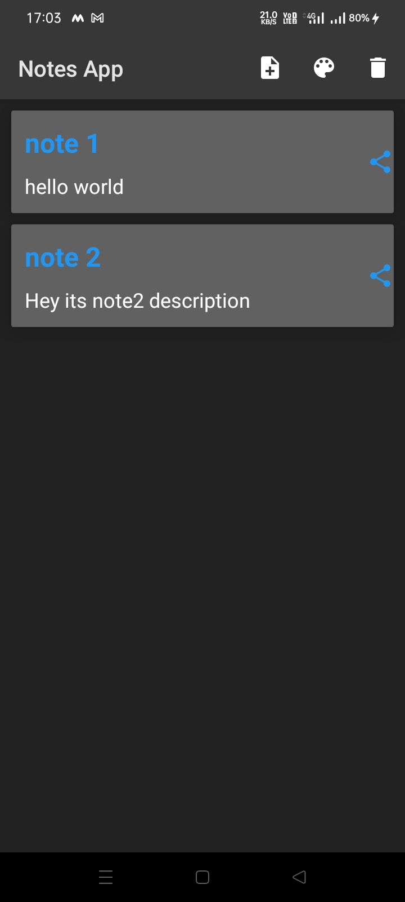
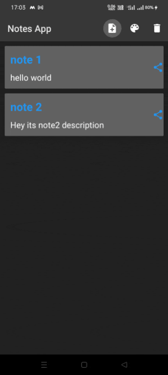
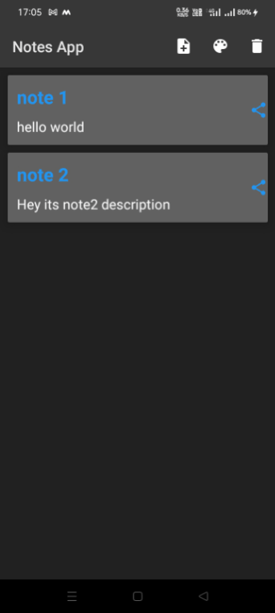
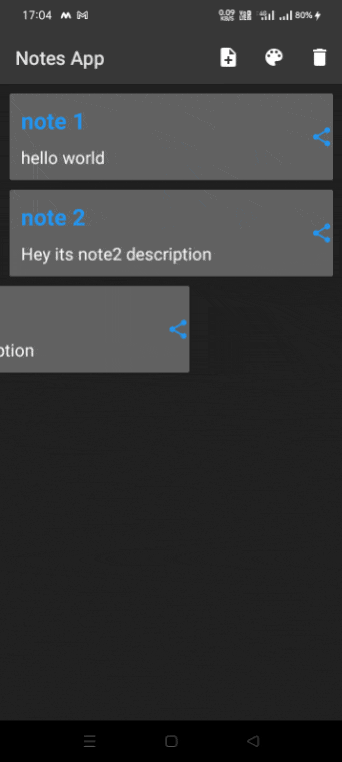
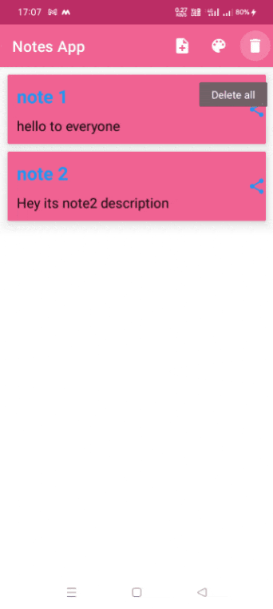
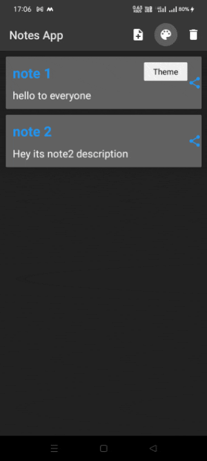

# NotesApp
This is a Note Application helps you to create your notes. You can create, edit and
delete notes. This app also have feature of sharing your notes to other. App
follows MVVM architecture.
### Architecture:-
MVVM is one of the architectural patterns which enhances separation of concerns, it
allows separating the user interface logic from the business (or the back-end)
logic. Its target (with other MVC patterns goal) is to achieve the following
principle “Keeping UI code simple and free of app logic in order to make it easier
to manage”.

- Lifecycles: It manages activity and fragment lifecycles of our app, survives
configuration changes, avoids memory leaks and easily loads data into our UI.

- LiveData: It notifies views of any database changes. Use LiveData to build data
objects that notify views when the underlying database changes.

- Room: Database layer on top of a SQLite database that takes care of mundane tasks
that you used to handle with a helper class. The Room database uses the DAO to
issue queries to the SQLite database based on functions called.

- ViewModel: Provides data to the UI and acts as a communication center between the
Repository and the UI. Hides the backend from the UI. ViewModel instances survive
device configuration changes.

- Repository: A class that you create for managing multiple data sources. In
addition to a Room database, the Repository could manage remote data sources such
as a web server.

- DAO: Short for data access object . A mapping of SQL queries to functions. You
used to have to define these queries in a helper class.

- Entity: In the context of Architecture Components, the entity is an annotated
class that describes a database table.

### Features :
- Create Note
- Update Note
- Delete Note
- Share Note to others
- Change to Light and Dark Theme
- App can also handle Phone rotations.So, it can also be used in landscape mode.

### Library Used :
- Room
- Coroutines
- ViewModel
- LiveData
- Material Library

### Screenshots

### List Notes,  Add Note,  Update Note, Delete Node, Delete All, Theme Change

</p
